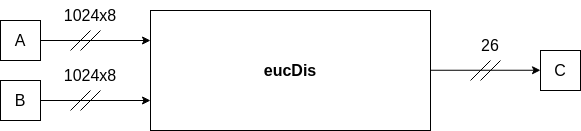
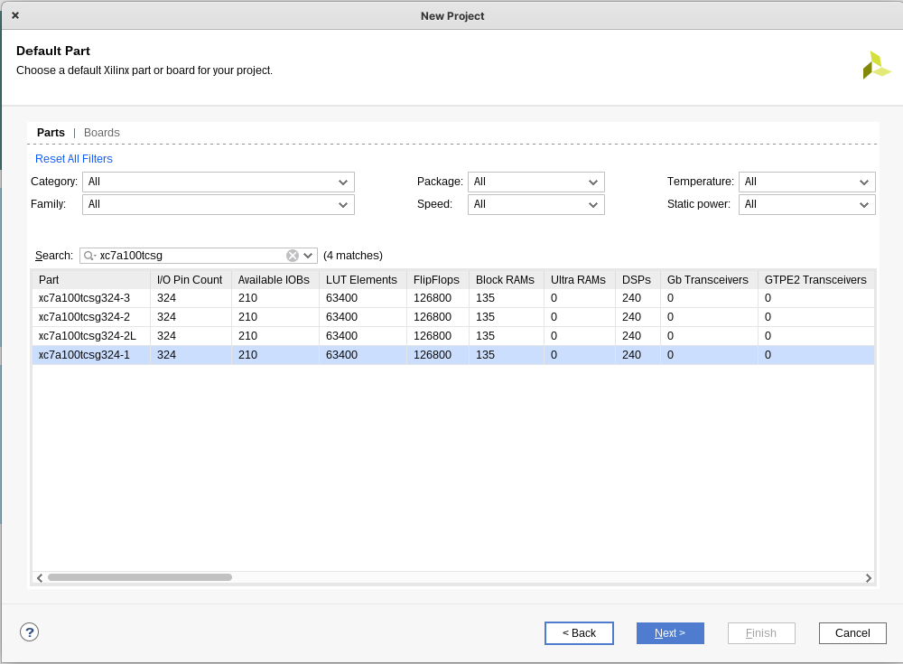

# High Level Synthesis

En la siguiente sección se explicará el proceso para a partir de un código implementado en lenguaje C++, poder implementar un bloque (circuito lógico) que sea capaz de tomar dos entradas de 1024 valores x 8 bits, para entregar la distancia Euclidiana de ambos vectores. Este proceso de tomar un código de alto nivel (C++) y llevarlo a una implementación en FPGA se denomina _High Level Synthesis_.

<p align="center">
  
</p>

En la Figura, se puede ver el bloque que se espera implementar. Como entrada, los vectores **A** y **B**, cada uno de 1024x8 bits. La salida, **C**, corresponde a un **único valor de 26 bits.**

Un análisis más fino del código utilizado para la síntesis de alto nivel, se puede encontrar en el [README](/hls/vitis_hls/README.md) de la carpeta _vitis_hls_.

## Índice

1. [Requisitos](#requisitos)

## Requisitos:

Para poder seguir las instrucciones que se listaran a continuación es necesario tener previamente instalado una versión de **Vivado y Vitis HLS.** Durante el desarrollo de este tutorial se estuvo trabajando con las versiones otorgadas por Xilinx: 2021.1

Si bien no es requisito, pero el hardware utilizado para el presente tutorial corresponde a una tarjeta de desarrollo: **Nexys 4 DDR**, con un chip **xc7a100tcsg324-1**.


## Instrucciones:

### Vitis HLS: Generación de módulo a partir de código de alto nivel

#### 1. Creación de proyecto en Vitis HLS
<p align="center">
  
</p>

##### Generación proyecto

En primer lugar se tiene que generar un nuevo proyecto dentro de Vitis HLS, para ello se puede hacer click en: "Create Project", esto desplegara un menú con opciones:

<p align="center">
  
</p>

Para el nombre del proyecto / **Project Name**, se puede escoger cualquiera, en el caso de este tutorial se eligió: _eucDis__. En la ubicación es recomendable escoger la carpeta _vitis_hls_ que se encuentra dentro de los archivos del repositorio.  En el caso de este ejemplo la carpeta completa del repositorio ha sido clonada en la carpeta de usuario (/home/mauricio/). Luego de configurar estos parámetros se da click a _Next_.

##### Añadiendo sources

<p align="center">
  
</p>

En este menú se podrán añadir los códigos fuentes, en este caso, corresponden a los códigos en C++ que describen la funcionalidad que se busca, un módulo de cálculo de distancia Euclidiana. **En primer lugar**, haciendo click en _Add Files_, se añaden los archivos: _eucMod.cpp_ y _eucMod.h_, que se encuentran dentro de la carpeta [vitis_hls](/hls/vitis_hls). **Luego de esto**, en el apartado denominado _Top Function_, se hace click en _Browse_ para escoger la función principal, que en este caso corresponde a la denominada _eucDis_. Finalmente, se da click a _next_.

##### Añadiendo testbench
<p align="center">
  
</p>

En esta sección se añaden las pruebas a las que se someterá tanto el código implementada y el módulo generado en contraste con el código de alto nivel original. Para ello se diseñan dos archivos que se deben añadir, desde la carpeta _vitis_hls_. **En primer lugar**, se debe añadir el archivo denominado _testbench.cpp_, este archivo contiene una prueba que compara el funcionamiento del código implementado en C++ para la obtención de la distancia Euclidiana entre los vectores A y B, y el módulo inferido a partir del código de alto nivel. **En segundo lugar**, se añade el archivo denominado _goldenreference.csv_, el cual tiene los vectores generados mediante el script [goldenGenerator.py](/hls/utils/goldenGenerator.py), los cuales son utilizados como entrada para el algoritmo de prueba. Detalles de la generación de estos valores de referencia pueden ser encontrados en el [README](/hls/utils/README.md) de la sección _utils_.

##### Configuración de la solución y selección de hardware target

<p align="center">
  
</p>

En esta sección se puede dar un nombre a la solución a implementar, en este caso se puede dejar el por defecto: _solution1_. Se puede dar la configuración del reloj que controlará la solución a implementar en este caso, se deja por defecto en 10 _ns_. Finalmente, en la sección de _Part Selection_, se selecciona el hardware target, en nuestro caso, se utiliza la placa de desarrollo Nexys 4 DDR, con un chip : xc7a100tcsg324-1, por lo que se ha seleccionado esta. Finalmente se le da click a _Finish_ y se habrá configurado el proyecto de manera exitosa.

#### 2. Simulación del código de alto nivel

<p align="center">
  
</p>

Dentro de las herramientas ofrecidas por Vitis HLS, se encuentra la capacidad de comprobar el funcionamiento del código de alto nivel mediante una simulación. Esto se refiere a utilizar el testbench (_testbench.cpp_), para comprobar que el resultado del código sea el deseado.

<p align="center">
  
</p>

Desde el panel de _Flow Navigator_, se puede escoger la opción _Run C Simulation_, esto generará la compilación y resultado del testbench que se incluyo en la estapa previa (_testbench.cpp_). Luego de esto, comenzara a compilarse y correr el código lo que se podrá observar mediante la actividad mostrada por la consola de Vitis HLS. Cuando se termine de correr el testbench, se desplegará un archivo con extensión _.log_ que contendrá los resultados de la prueba al código de alto nivel. Para el testbench provisto se esperan los siguientes resultados:

```
INFO: [SIM 2] *************** CSIM start ***************
INFO: [SIM 4] CSIM will launch GCC as the compiler.
make: 'csim.exe' is up to date.
Running C++ Simulation!
-----------------------------------
Valor esperado: 3452
Valor calculado: 3452
Diferencia directa: 0
Diferencia relativa: 0
-----------------------------------
PASSED!
-----------------------------------
INFO: [SIM 1] CSim done with 0 errors.
INFO: [SIM 3] *************** CSIM finish ***************

```
**Nota #1**: Si bien el resultado del testbench se muestra tanto en la consola como en el archivo _.log_ desplegado, siempre es mejor observar los resultados de la consola, dado que se ha encontrado ocasiones que luego de correr varias veces el _testbench_, el archivo log desplegado a veces no es actualizado, dando por resultado situaciones de falsos _Passed/Failed_.

**Nota #2**: Vitis HLS tiene la habilidad de desplegar ventanas emergentes con error asociado a los testbench, en el caso de que el código contenga un _print_ con las palabras: "Error" o "Failed". Esto es bastante útil dado que es bastante claro cuando el comportamiento del código no es el esperado, sin la necesidad de trabajar con excepciones o alguna otra forma de aviso mediante código.

#### 3. Síntesis

<p align="center">
  
</p>

En esta etapa Vitis HLS, a partir del código de alto nivel, genera la implementación a partir del comportamiento asociado a la funcionalidad del código.

<p align="center">
  
</p>

Para iniciar el proceso, desde el menú _Flow Navigator_, se escoge la opción _Run C Synthesis_.

<p align="center">
  
</p>

Se desplegará un menú de opciones en el cual se puede confirmar parámetros del reloj asociado a la implementación y el hardware target. Estos corresponden a los escogidos anteriormente. Se procede a confirmar seleccionando _OK_, de esta forma iniciando el proceso de síntesis. Para el módulo provisto, se espera que el tiempo de síntesis sea de aproximadamente ~ 10 minutos.

<p align="center">
  
</p>

Luego de completarse la síntesis, se desplegará un reporte con los resultados, principalmente de _timming_ y uso de recursos estimados. El análisis de estos resultados se reportaran en una sección posterior.

#### 4. Co-Simulación

_Vitis HLS_ permite realizar la Co-Simulación entre el bloque descrito en un lenguaje de alto nivel y el inferido de este. Para ello se utiliza el _testbench_ implementado para verificar el funcionamiento del código de alto nivel.

<p align="center">
  
</p>

Para utilizarlo, desde el menú _Flow Navigator_, se hace click en _Run Cosimulation_.

<p align="center">
  
</p>

Esto desplegará el menú de configuraciones para la cosimulación, se dejan todos los parámetros por defecto y se da click a _OK_, dando inicio al proceso.

**Nota:** El proceso de cosimulación puede ser bastante largo e intensivo en recursos del computador.

<p align="center">
  
</p>

Luego de finalizarse el proceso, se desplegará un reporte, que en el campo _Status_ informará si el módulo inferido pasó o no (Pass/Failed) el _testbench_. Además se entregará información del _timming_ para la simulación.


#### 5. Exportar a Vivado

<p align="center">
  
</p>

En esta etapa, se puede exportar el módulo sintetizado desde Vitis HLS hacia Vivado para que sea utilizado como un módulo IP.

<p align="center">
  
</p>

Desde el menú _Flow Navigator_, se escoge la opción _Export RTL_.

<p align="center">
  
</p>

Se desplegará un sub-menú, en el cual se podrá escoger el directorio de salida (_Output Location_). Dentro del repositorio ya se incluye en la carpeta [exported_ip](/hls/exported_ip) un ejemplo del resultado de la exportación del módulo desde Vitis HLS. Como resultado del proceso, se debe obtener un archivo _.zip_ que contiene el módulo. Antes de que este pueda ser usado en Vivado, se debe descomprimir, en el caso del _zip_ provisto dentro de _exported_ip_, se puede descomprimir dentro de esta carpeta.

**Nota:** Se debe indicar la versión para el módulo dado que sino se encontrará un error al momento de realizar la exportación. Se puede poner un valor por defecto, en este caso se utiliza : 1.0.0

#### 6. Creación de Proyecto en Vivado

Para la generación del proyecto de Vivado, se hará una breve explicación de los parámetros del proyecto a generar, dado que no es el enfoque de este tutorial

##### Sources a incluir

<p align="center">
  
</p>

- Desde el botón _Add Files_ se deben incluir todos los archivos con extensión _.sv_ presentes en el directorio [vivado](/hls/vivado)

- Desde el botón _Add Directories_ se debe incluir la carpeta `UART` presente en la misma carpeta: [vivado](/hls/vivado)

##### Constraint

<p align="center">
  
</p>

- Dentro de los archivos entregados en la carpeta [vivado](/hls/vivado), se encuentra un archivo _constraint_ `constraint_coprocessor.xdc` el cual debe ser incluido con el proyecto.


##### Target Hardware
<p align="center">
  
</p>

- Siguiendo las instrucciones utilizadas en Vitis HLS, se selecciona como target la tarjeta de desarrollo Nexys 4 DDR: `xc7a100tcsg324-1`

##### Añadiendo Repositorio de IP

Las fuentes del proyecto provisto, incluyen previamente instanciado el módulo exportado desde _Vitis HLS_, este se encuentra en el archivo [`op_module.sv`](/hls/vivado/op_module.sv). Sin embargo, es necesario incluir el directorio (repositorio local) donde se encuentran los archivos extraídos desde el _.zip_ exportado desde _Vitis HLS_.

<p align="center">
  
</p>

Como se puede apreciar, al revisar las sources del proyecto, el módulo `op_module.sv` espera tener una instancia del módulo `EUC_HLS`, sin embargo no se encuentra el módulo asociado.

<p align="center">
  
</p>

1. Desde _Project Manager_ se abre el _IP Catalog_.
2. Haciendo clik derecho sobre el listado de repositorios se selecciona _Add Repository_, esto desplegara una ventana donde se puede seleccionar el directorio donde se ha descomprimido el _.zip_ obtenido desde _Vitis HLS_. En el caso de este ejemplo se ha descomprimido en la carpeta `/exported_ip`.

<p align="center">
  
</p>

3. Luego de haber añadido el repositorio, aparecerá una sección denominada _User Repository_, dentro de la cual se encontrará el módulo IP a incorporar.

<p align="center">
  
</p>

4. Haciendo doble click sobre el módulo, abrirá una ventana de configuración, dar click a _OK._.

**Nota:** A la izquierda puede verse el módulo como bloque, se ve de esta manera, debido a que al realizar _array_partition_ mediante _pragmas_ (Veáse el [README.md](/hls/vitis_hls/README.md) para más información), los puertos correspondientes a los vectores A y B, se consideran por elemento, dando que el módulo tenga 2048 entradas, sin contar las que se añaden de forma automática.

<p align="center">
  
</p>

5. Se desplegará un menú para la generación del módulo IP. Note que se da acceso a un _Instatation Template_, se recomienda utilizar éste como base en conjunto con el script e instrucciones para uso provistas en el [README.md](/hls/vitis_hls/utils/README.md) de la sección _/hls/vitis_hls/utils_, dado que asignar cada bus (vectores A y B) de forma individual para cada una de las 2048 entradas. Para finalizar, se da click en _Generate_.

<p align="center">
  
</p>

6. Luego de haber realizado estos pasos, al revisar en las _design sources_ se puede observar que el módulo es correctamente listado.

7. El proceso después continua normalmente con la síntesis, implementación y generación del bit stream.
