# Sistema Heterogéneo en _SoC Zynq_

En la siguiente sección se explicará el _workflow_ asociado al trabajo con sistemas heterogéneos. En este caso, se realizará la comparación para el computo de la distancia Euclidiana, en la tarjeta Zybo, mediante el cómputo en el procesador ARM (PS), quién también cumplirá el rol de host, y un módulo coprocesador, similar al implementado en la sección de _HLS_, implementado en la FPGA (PL), y conectado al procesador PS mediante interfaces AXIs. Se implementan dos versiones, las cuales trabajan como base con salidas y entradas de 32 bits, pero una trabaja con enteros y la otra con números flotantes. En ambos casos, mediciones de rendimiento (latencia) son tomadas, tanto para PS como PL, de esta forma pudiendo comparar el rendimiento de ambos sistemas.

## Índice

- [Requisitos](#requisitos)
- [Instrucciones](#instrucciones)
    - [Vitis HLS: Generación de módulo a partir de código de alto nivel](#vitis-hls-generación-de-módulo-a-partir-de-código-de-alto-nivel)
        1. [Creación de proyecto en Vitis HLS](#1-creación-de-proyecto-en-vitis-hls)
            - [Generación proyecto](#generación-proyecto)
            - [Añadiendo sources](#añadiendo-sources)
            - [Añadiendo testbench](#añadiendo-testbench)
            - [Configuración de la solución y selección de hardware target](#configuración-de-la-solución-y-selección-de-hardware-target)
        2. [Simulación del código de alto nivel](#2-simulación-del-código-de-alto-nivel)
        3. [Síntesis](#3-síntesis)
        4. [Co-Simulación](#4-co-simulación)
        5. [Exportar a Vivado](#5-exportar-a-vivado)
    - [Vivado: Creación de Proyecto usando el módulo exportado](#vivado-creación-de-proyecto-usando-el-módulo-exportado)
        1. [Creación del proyecto](#creación-del-proyecto)


## Requisitos
  El hardware utilizado para el presente tutorial corresponde a una tarjeta de desarrollo: **Zybo/Zynq -7000**, con un chip: **xc7z010clg400-1**.

## Instrucciones:

A continuación se dejan las instrucciones para el _workflow_ completo. Se ilustrará el progreso utilizando como ejemplo la versión que funciona con números enteros, sin embargo, los pasos son análogos para la versión flotante y se dejarán comentarios explicitos de los cambios necesarios para cada caso.

### Vitis HLS: Generación de módulo a partir de código de alto nivel

#### 1. Creación de proyecto en Vitis HLS

<p align="center">
  
</p>

##### Generación proyecto
En primer lugar se tiene que generar un nuevo proyecto dentro de Vitis HLS, para ello se puede hacer click en: "Create Project", esto desplegara un menú con opciones:

<p align="center">
  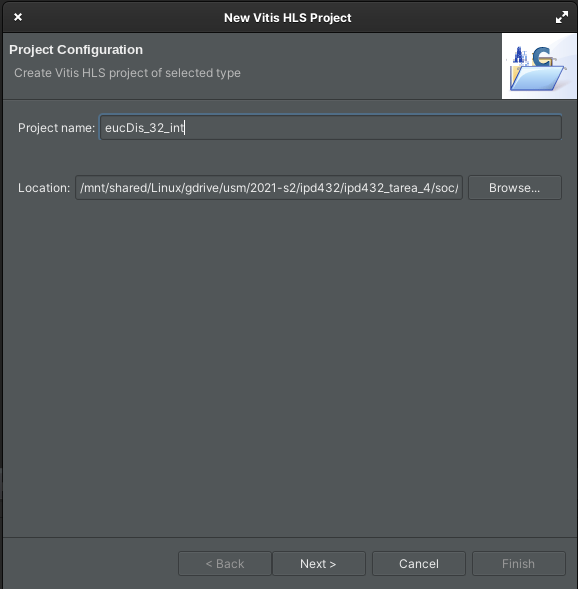
</p>

Para el nombre del proyecto / **Project Name**, se debe escoger `eucDis_32_int` en el caso del módulo para enteros y `eucDis_32_float` en el caso del módulo para flotantes. En la ubicación es recomendable escoger la carpeta asociada a la versión, que se encuentran en el directorio de la sección de [Vitis HLS](/soc/vitis_hls), de esta forma las configuraciones para cada versión quedan de la siguiente forma:

| **Versión** | **Project Name** | **Location** |
|-------------|------------------|--------------|
| _int_ | `eucDis_32_int` | /soc/vitis_hls/eucDis_32_int |
| _float_ | `eucDis_32_float` | /soc/vitis_hls/eucDis_32_float |

**Nota:** Es recomendable mantener los nombres consistentes, dado que para la sección final a realizarse en Vitis, asegurará que el código no tenga problemas a nivel de diferencia de nombres.


Luego de configurar los parámetros adecuados para cada versión se da click a _Next_.

##### Añadiendo sources
<p align="center">
  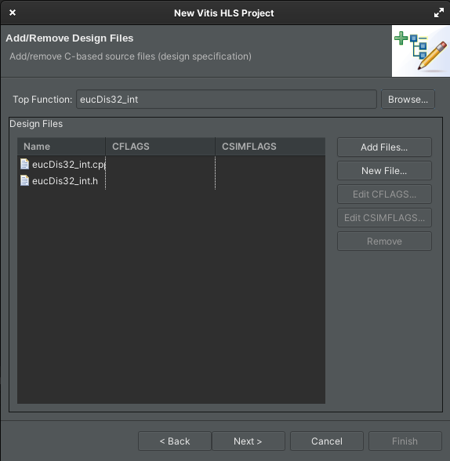
</p>

En este menú se podrán añadir los códigos fuentes, en este caso, corresponden a los códigos en C++ que describen la funcionalidad que se busca. **En primer lugar**, haciendo click en _Add Files_, se deben escoger los archivos correspondientes para la versión deseada:

| **Versión** | **Archivos a añadir**| **Ubicación archivos** |
|-------------|----------------------|-------------|
| _int_ | `eucDis32_int.cpp` y `eucDis32_int.h` | [soc/vitis_hls/eucDis32_int/](/soc/vitis_hls/eucDis32_int/) |
| _float_ | `eucDis32_float.cpp` y `eucDis32_float.h` | [soc/vitis_hls/eucDis32_float/](/soc/vitis_hls/eucDis32_float/) |


**Luego de esto**, en el apartado denominado _Top Function_, se hace click en _Browse_ para escoger la función principal, que tendrá el mismo nombre del archivo `.cpp` que se haya seleccionado (según versión). Finalmente se da click a _Next_.

##### Añadiendo testbench
<p align="center">
  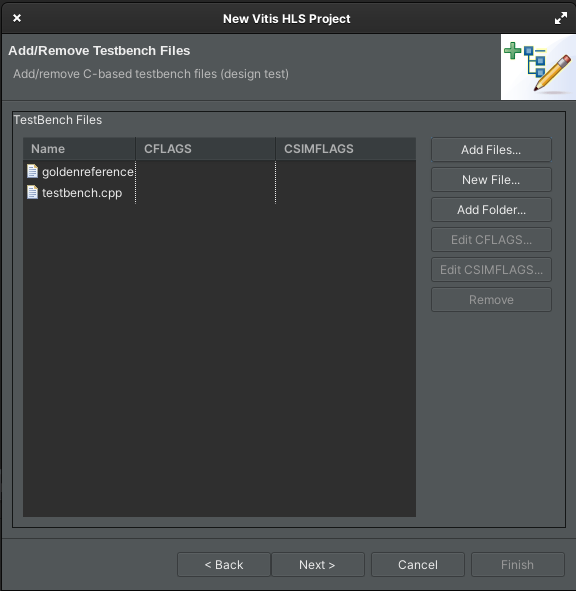
</p>


En esta sección se añaden las pruebas a las que se someterá tanto el código implementada y el módulo generado en contraste con el código de alto nivel original. Para ello se diseñan dos archivos que se deben añadir, desde la carpeta respectiva de cada versión. **Los archivos comparten nombre sin embargo son distintos, por lo que se debe verificar si se están añadiendo los archivos de la carpeta correcta para cada versión**:

| **Versión** | **Archivos a añadir**| **Ubicación archivos** |
|-------------|----------------------|-------------|
| _int_ | `testbench.cpp` y `_goldenreference.csv` | [soc/vitis_hls/eucDis32_int/](/soc/vitis_hls/eucDis32_int/) |
| _float_ | `testbench.cpp` y `_goldenreference.csv` | [soc/vitis_hls/eucDis32_float/](/soc/vitis_hls/eucDis32_float/) |

 **En primer lugar**, se debe añadir el archivo denominado _testbench.cpp_, este archivo contiene una prueba que compara el funcionamiento del código implementado en C++ para la obtención de la distancia Euclidiana entre los vectores A y B, y el módulo inferido a partir del código de alto nivel. **En segundo lugar**, se añade el archivo denominado _goldenreference.csv_, el cual tiene los vectores generados mediante el script [goldenGenerator.py](/hls/utils/goldenGenerator.py), los cuales son utilizados como entrada para el algoritmo de prueba. Detalles de la generación de estos valores de referencia pueden ser encontrados en el [README](/hls/utils/README.md) de la sección _utils_. Se le da click a _Next_ para continuar.

#####  Configuración de la solución y selección de hardware target

<p align="center">
  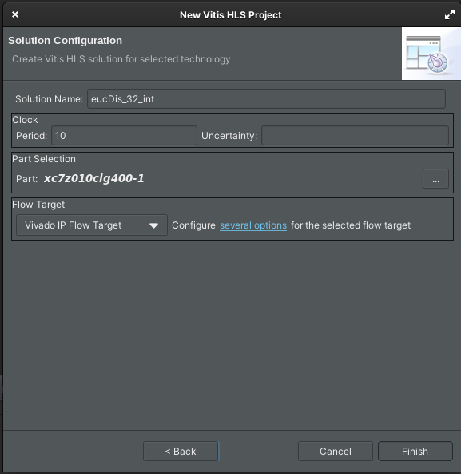
</p>

En esta sección se puede dar un nombre a la solución a implementar y se puede dar la configuración del reloj. Para cada versión se eligen los siguientes parámetros:

| **Versión** | **Solution Name** | **Clock Period**|
|-------------|-------------------|-----------------|
| _int_ | eucDis_32_int | 10 |
| _flot_ | eucDis_32_float | 13.5|


Finalmente, en la sección de _Part Selection_, se selecciona el hardware target, en ambos casos, se utiliza la placa de desarrollo **Zybo/Zynq -7000**, con un chip: **xc7z010clg400-1**. Finalmente se le da click a _Finish_ y se habrá configurado el proyecto de manera exitosa.

### 2. Simulación del código de alto nivel
<p align="center">
  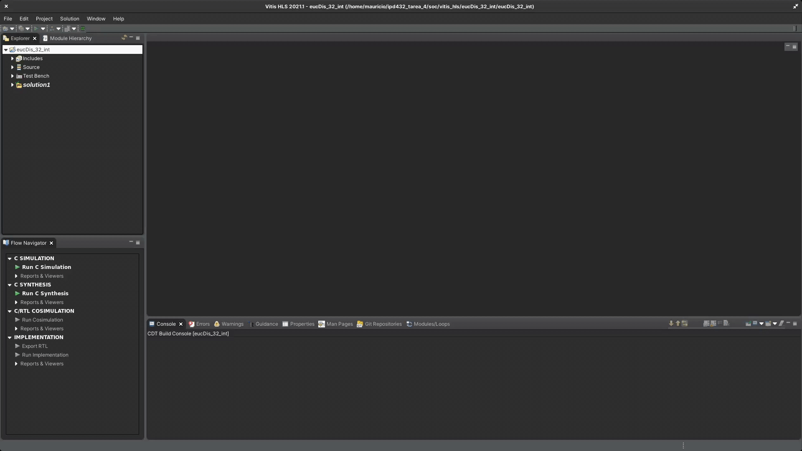
</p>

Dentro de las herramientas ofrecidas por Vitis HLS, se encuentra la capacidad de comprobar el funcionamiento del código de alto nivel mediante una simulación. Esto se refiere a utilizar el testbench (_testbench.cpp_), para comprobar que el resultado del código sea el deseado.

<p align="center">
  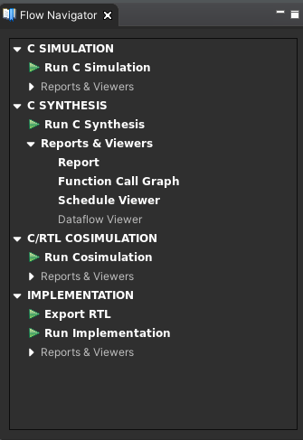
</p>

Desde el panel de _Flow Navigator_, se puede escoger la opción _Run C Simulation_, esto generará la compilación y resultado del testbench que se incluyo en la estapa previa (_testbench.cpp_). Luego de esto, comenzara a compilarse y correr el código lo que se podrá observar mediante la actividad mostrada por la consola de Vitis HLS. Cuando se termine de correr el testbench, se desplegará un archivo con extensión _.log_ que contendrá los resultados de la prueba al código de alto nivel. Para el testbench provisto para la versión de números enteros se esperan los siguientes resultados:

```
INFO: [SIM 2] *************** CSIM start ***************
INFO: [SIM 4] CSIM will launch GCC as the compiler.
   Compiling ../../../../testbench.cpp in debug mode
   Compiling ../../../../eucDis32_int.cpp in debug mode
   Generating csim.exe
Running C++ Simulation!
27120
-----------------------------------
Valor esperado: 27120
Valor calculado: 27120
Diferencia directa: 0
Diferencia relativa: 0
-----------------------------------
PASSED!
-----------------------------------
INFO: [SIM 1] CSim done with 0 errors.
INFO: [SIM 3] *************** CSIM finish ***************
```
Para el caso del _testbench_ para el módulo que trabaja con números flotantes, se espera un resultado análogo.

**Nota #1**: Si bien el resultado del testbench se muestra tanto en la consola como en el archivo _.log_ desplegado, siempre es mejor observar los resultados de la consola, dado que se ha encontrado ocasiones que luego de correr varias veces el _testbench_, el archivo log desplegado a veces no es actualizado, dando por resultado situaciones de falsos _Passed/Failed_.

**Nota #2**: Vitis HLS tiene la habilidad de desplegar ventanas emergentes con error asociado a los testbench, en el caso de que el código contenga un _print_ con las palabras: "Error" o "Failed". Esto es bastante útil dado que es bastante claro cuando el comportamiento del código no es el esperado, sin la necesidad de trabajar con excepciones o alguna otra forma de aviso mediante código.

#### 3. Síntesis
<p align="center">
  
</p>

En esta etapa Vitis HLS, a partir del código de alto nivel, genera la implementación a partir del comportamiento asociado a la funcionalidad del código.

<p align="center">
  
</p>

Para iniciar el proceso, desde el menú _Flow Navigator_, se escoge la opción _Run C Synthesis_.

<p align="center">
  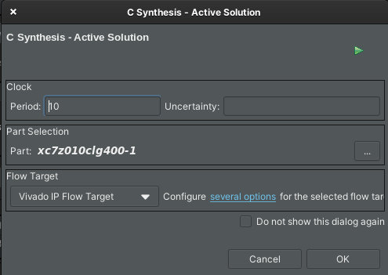
</p>

Se desplegará un menú de opciones en el cual se puede confirmar parámetros del reloj asociado a la implementación y el hardware target. Estos corresponden a los escogidos anteriormente. Se procede a confirmar seleccionando _OK_, de esta forma iniciando el proceso de síntesis.

<p align="center">
  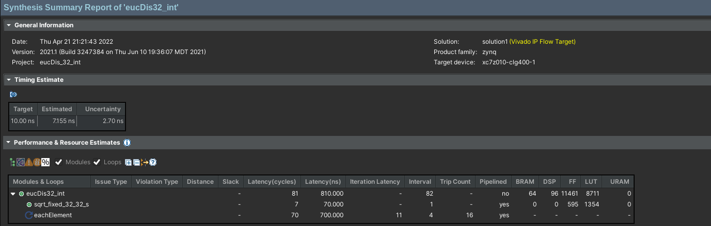
</p>

Luego de completarse la síntesis, se desplegará un reporte con los resultados, principalmente de _timming_ y uso de recursos estimados, en la imagen se muestran los resultados obtenidos para la versión del módulo que trabaja con enteros. Los resultados para el módulo con números float y un análisis de ambos resultados se encuentran en la sección de resultados.

#### 4. Co-Simulación

_Vitis HLS_ permite realizar la Co-Simulación entre el bloque descrito en un lenguaje de alto nivel y el inferido de este. Para ello se utiliza el _testbench_ implementado para verificar el funcionamiento del código de alto nivel.

<p align="center">
  
</p>

Para utilizarlo, desde el menú _Flow Navigator_, se hace click en _Run Cosimulation_.

<p align="center">
  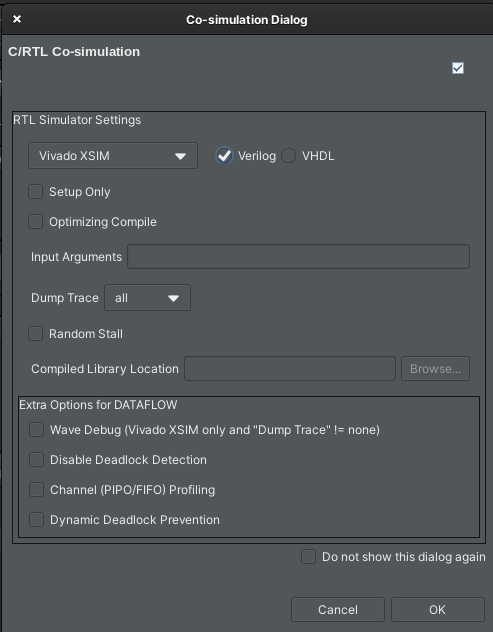
</p>

Esto desplegará el menú de configuraciones para la cosimulación, se dejan todos los parámetros por defecto y se da click a _OK_, dando inicio al proceso.

**Nota:** El proceso de cosimulación puede ser bastante largo e intensivo en recursos del computador.

<p align="center">
  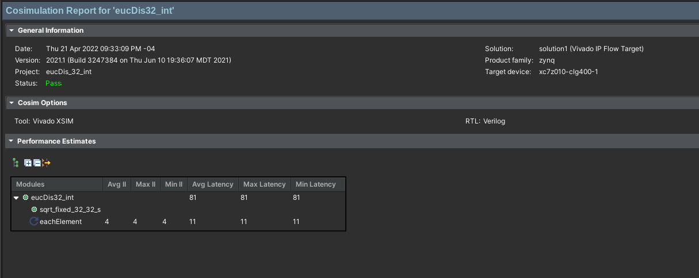
</p>

Luego de finalizarse el proceso, se desplegará un reporte, que en el campo _Status_ informará si el módulo inferido pasó o no (Pass/Failed) el _testbench_. Además se entregará información del _timming_ para la simulación.


#### 5. Exportar a Vivado

<p align="center">
  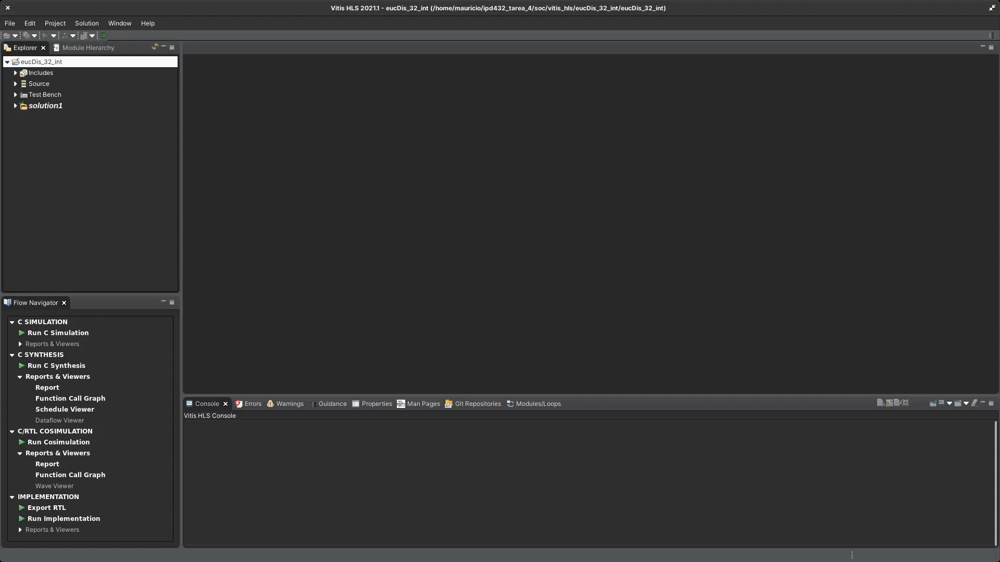
</p>

En esta etapa, se puede exportar el módulo sintetizado desde Vitis HLS hacia Vivado para que sea utilizado como un módulo IP.

<p align="center">
  
</p>

Desde el menú _Flow Navigator_, se escoge la opción _Export RTL_.

<p align="center">
  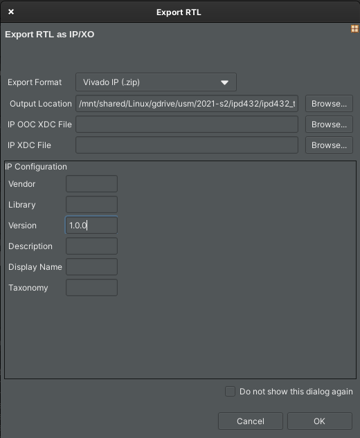
</p>

Se desplegará un sub-menú, en el cual se podrá escoger el directorio de salida (_Output Location_). Dentro del repositorio ya se incluye en la carpeta [vivado/ip_exported](/soc/vivado/ip_exported) el resultado de la exportación del módulo, tanto para números enteros como flotantes, desde Vitis HLS. Como resultado del proceso, se debe obtener un archivo _.zip_ que contiene el módulo. Antes de que este pueda ser usado en Vivado, se debe descomprimir, en el caso del _zip_ provisto dentro de _exported_ip_, se puede descomprimir dentro de esta carpeta.

**Nota:** Se debe indicar la versión para el módulo dado que sino se encontrará un error al momento de realizar la exportación. Se puede poner un valor por defecto, en este caso se utiliza : 1.0.0

### Vivado: Creación de Proyecto usando el módulo exportado
<p align="center">
  
</p>

#### 1. Creación del proyecto

<p align="center">
  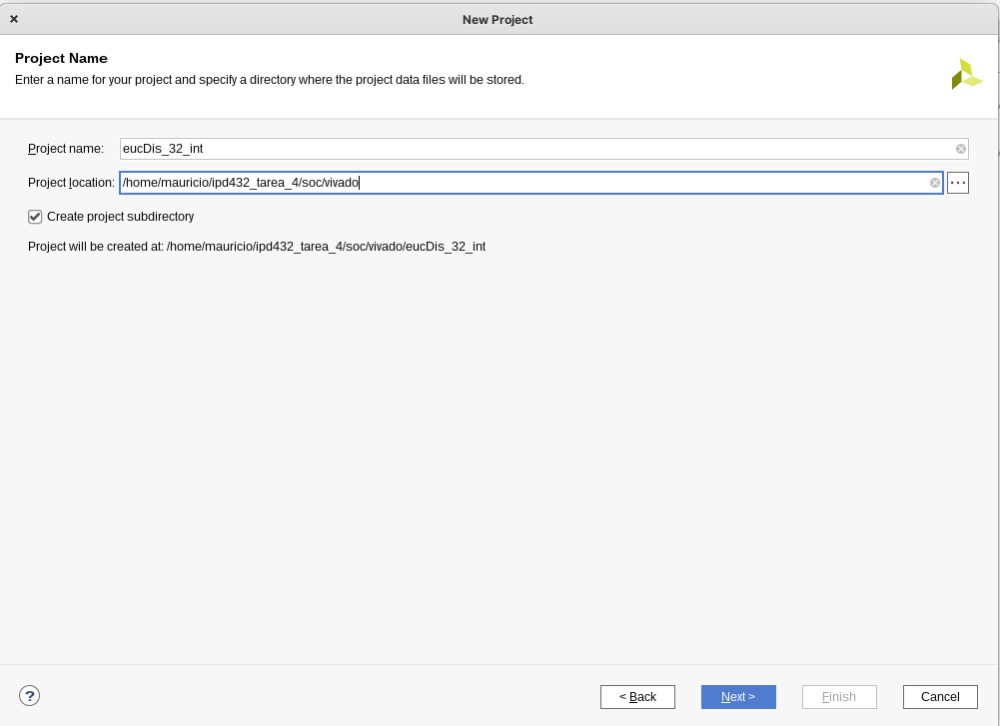
</p>

Se debe generar un nuevo proyecto en Vivado, dada la versión del módulo con la que se esté trabajando el proyecto se debe denominar:

| **Versión** | **Project Name** |
|-------------|------------------|
| _int_ | eucDis_32_int |
| _float_ | eucDis_32_float|

La ubicación recomendada, es en la carpeta del repositorio [/soc/vivado](/soc/vivado). Se debe mantener chequeada la opción _Create Project Subdirectory_.

<p align="center">
  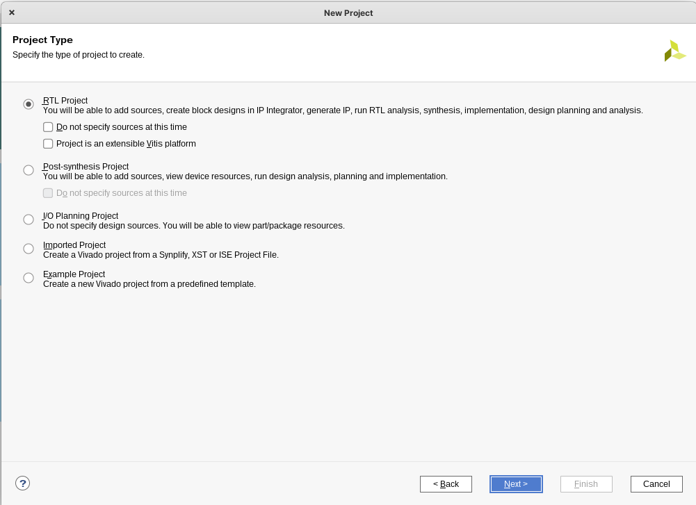
</p>

Se debe escoger _RTL Project_.

<p align="center">
  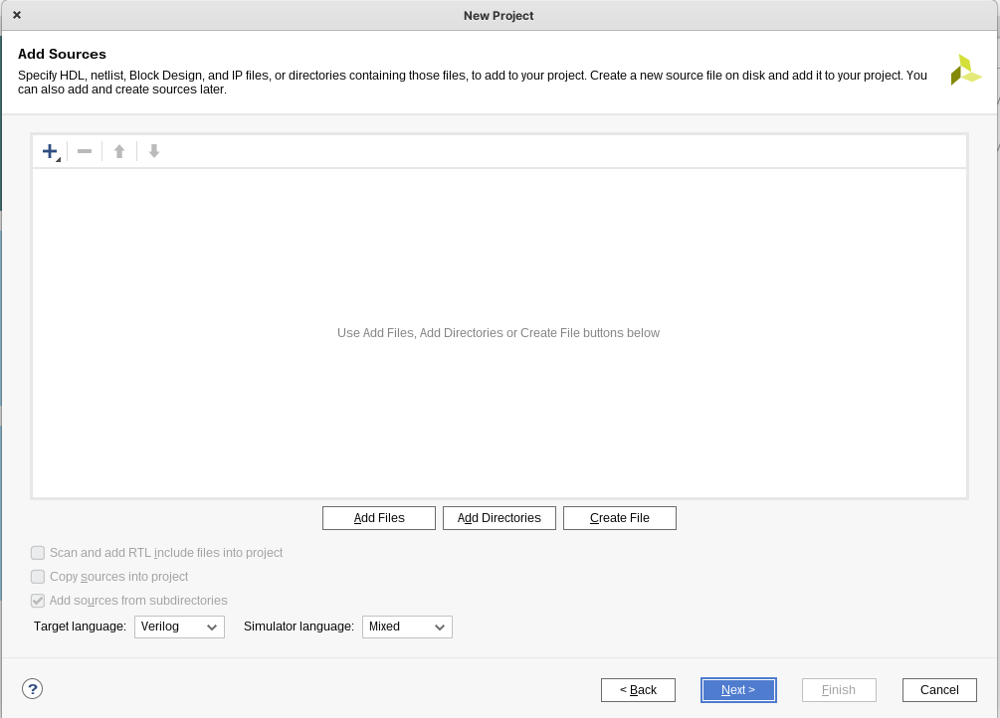
</p>

Se debe dejar sin sources.

<p align="center">
  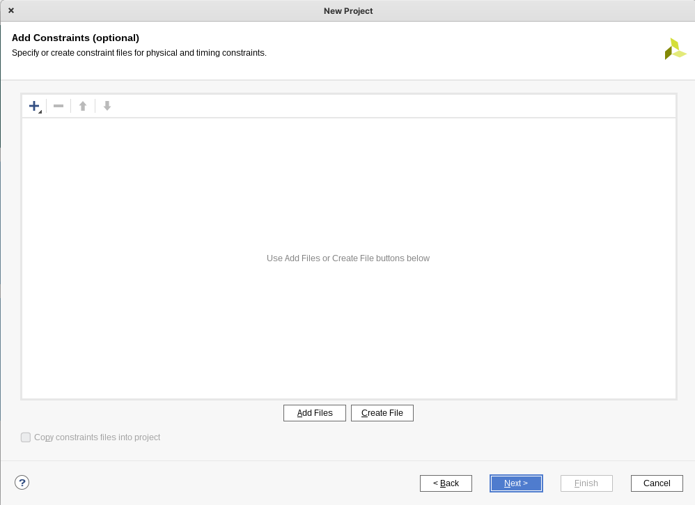
</p>

Se debe dejar sin constraints.

<p align="center">
  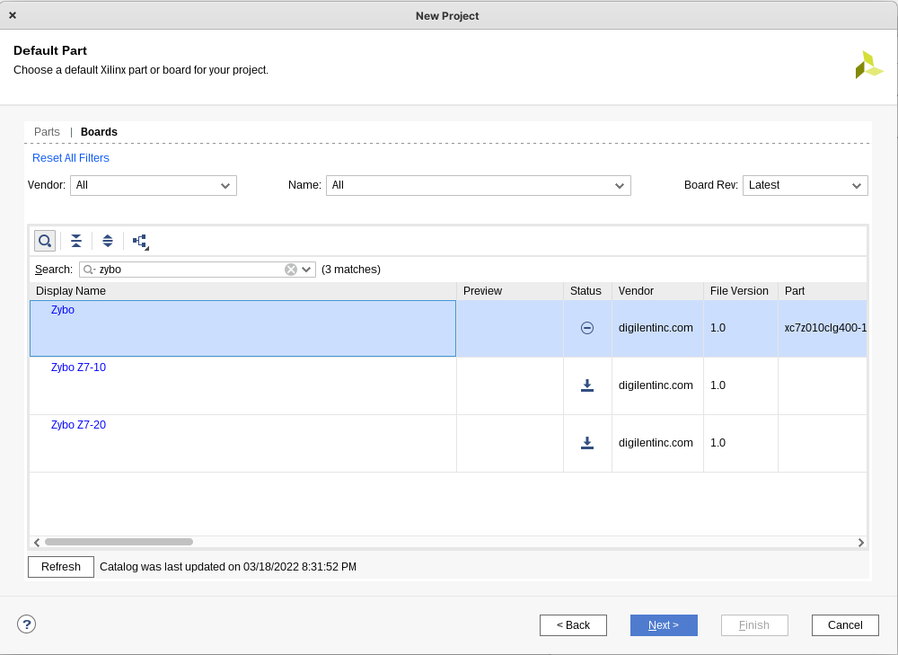
</p>

Para la selección de plataforma, se debe ir a la pestaña _Boards_ y en el buscador escribir `zybo`, donde debería aparecer la plataforma que se busca, con campo `part` igual xc7z010clg400-1.

**Nota:** Verificar que en el campo _Status_ la plataforma aparece listada como `Installed`.

<p align="center">
  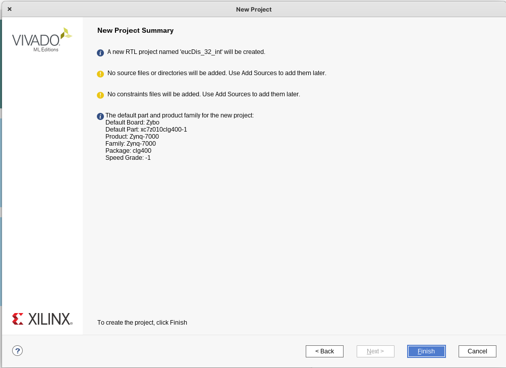
</p>

El proyecto debe haber quedado configurado de la siguiente manera (variando únicamente el nombre en el caso del módulo flotante), luego de verificar se le da click a _Finish_.
