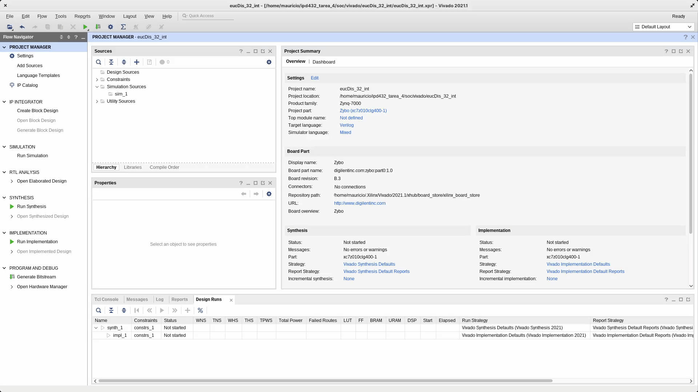

# Sistema Heterogéneo en _SoC Zynq_

En la siguiente sección se explicará el _workflow_ asociado al trabajo con sistemas heterogéneos. En este caso, se realizará la comparación para el computo de la distancia Euclidiana, en la tarjeta Zybo, mediante el cómputo en el procesador ARM (PS), quién también cumplirá el rol de host, y un módulo coprocesador, similar al implementado en la sección de _HLS_, implementado en la FPGA (PL), y conectado al procesador PS mediante interfaces AXIs. Se implementan dos versiones, las cuales trabajan como base con salidas y entradas de 32 bits, pero una trabaja con enteros y la otra con números flotantes. En ambos casos, mediciones de rendimiento (latencia) son tomadas, tanto para PS como PL, de esta forma pudiendo comparar el rendimiento de ambos sistemas.

## Índice

- [Requisitos](#requisitos)
- [Instrucciones](#instrucciones)
    - [Vitis HLS: Generación de módulo a partir de código de alto nivel](#vitis-hls-generación-de-módulo-a-partir-de-código-de-alto-nivel)
        1. [Creación de proyecto en Vitis HLS](#1-creación-de-proyecto-en-vitis-hls)
            - [Generación proyecto](#generación-proyecto)
            - [Añadiendo sources](#añadiendo-sources)
            - [Añadiendo testbench](#añadiendo-testbench)
            - [Configuración de la solución y selección de hardware target](#configuración-de-la-solución-y-selección-de-hardware-target)
        2. [Simulación del código de alto nivel](#2-simulación-del-código-de-alto-nivel)
        3. [Síntesis](#3-síntesis)
        4. [Co-Simulación](#4-co-simulación)
        5. [Exportar a Vivado](#5-exportar-a-vivado)
    - [Vivado: Creación de Proyecto usando el módulo exportado](#vivado-creación-de-proyecto-usando-el-módulo-exportado)
        1. [Creación del proyecto](#1-creación-del-proyecto)
        2. [Diseño por Block Diagram](#2-diseño-por-block-diagram)
        3. [Añadiendo repositorio](#3-añadiendo-repositorio)
        4. [Añadiendo módulos](#4-añadiendo-módulos)
        5. [Activando Interrupciones y validando diseño](#activando-interrupciones-y-validando-diseño)
            - [Opcional: Sólo para módulo flotante](#opcional-sólo-para-módulo-flotante)
        6. [Generando Wrapper y Bitstream](#6-generando-wrapper-y-bitstream)
        7. [Exportando Hardware](#7-exportando-hardware)
    - [Vitis: Programación en Processing System](#vitis-programación-en-processing-system)
        1. [Configuración de Workspace](#1-configuración-de-workspace)
        2. [Creación de Proyecto Aplicación](#2-creación-de-proyecto-aplicación)
        3. [Añadiendo sources](#3-añadiendo-sources)
        4. [Añadiendo biblioteca: math](#4-añadiendo-biblioteca-math)
        5. [Compilando el proyecto](#5-compilando-el-proyecto)
        6. [Carga de Bitstream y ejecutando el SoC](#6-carga-de-bitstream-y-ejecutando-en-el-soc)
        7. [Verificación funcionamiento](#7-verificación-funcionamiento)
- [Proceso de medición latencia: PS y PL](#proceso-de-medición-latencia-ps-y-pl)
    - [Uso puerto PMOD MIO](#uso-puerto-pmod-mio)
    - [Captura de datos con analizador lógico](#captura-de-datos-con-analizador-lógico)
    - [Procesado mediante script](#procesado-mediante-script)
- [Resultados](#resultados)

## Requisitos
  El hardware utilizado para el presente tutorial corresponde a una tarjeta de desarrollo: **Zybo/Zynq -7000**, con un chip: **xc7z010clg400-1**.

## Instrucciones:

A continuación se dejan las instrucciones para el _workflow_ completo. Se ilustrará el progreso utilizando como ejemplo la versión que funciona con números enteros, sin embargo, los pasos son análogos para la versión flotante y se dejarán comentarios explícitos de los cambios necesarios para cada caso.

### Vitis HLS: Generación de módulo a partir de código de alto nivel

#### 1. Creación de proyecto en Vitis HLS

<p align="center">
  
</p>

##### Generación proyecto
En primer lugar se tiene que generar un nuevo proyecto dentro de Vitis HLS, para ello se puede hacer click en: "Create Project", esto desplegara un menú con opciones:

<p align="center">
  
</p>

Para el nombre del proyecto / **Project Name**, se debe escoger `eucDis_32_int` en el caso del módulo para enteros y `eucDis_32_float` en el caso del módulo para flotantes. En la ubicación es recomendable escoger la carpeta asociada a la versión, que se encuentran en el directorio de la sección de [Vitis HLS](/soc/vitis_hls), de esta forma las configuraciones para cada versión quedan de la siguiente forma:

| **Versión** | **Project Name** | **Location** |
|-------------|------------------|--------------|
| _int_ | `eucDis_32_int` | /soc/vitis_hls/eucDis_32_int |
| _float_ | `eucDis_32_float` | /soc/vitis_hls/eucDis_32_float |

**Nota:** Es recomendable mantener los nombres consistentes, dado que para la sección final a realizarse en Vitis, asegurará que el código no tenga problemas a nivel de diferencia de nombres.


Luego de configurar los parámetros adecuados para cada versión se da click a _Next_.

##### Añadiendo sources
<p align="center">
  
</p>

En este menú se podrán añadir los códigos fuentes, en este caso, corresponden a los códigos en C++ que describen la funcionalidad que se busca. **En primer lugar**, haciendo click en _Add Files_, se deben escoger los archivos correspondientes para la versión deseada:

| **Versión** | **Archivos a añadir**| **Ubicación archivos** |
|-------------|----------------------|-------------|
| _int_ | `eucDis32_int.cpp` y `eucDis32_int.h` | [soc/vitis_hls/eucDis32_int/](/soc/vitis_hls/eucDis32_int/) |
| _float_ | `eucDis32_float.cpp` y `eucDis32_float.h` | [soc/vitis_hls/eucDis32_float/](/soc/vitis_hls/eucDis32_float/) |


**Luego de esto**, en el apartado denominado _Top Function_, se hace click en _Browse_ para escoger la función principal, que tendrá el mismo nombre del archivo `.cpp` que se haya seleccionado (según versión). Finalmente se da click a _Next_.

##### Añadiendo testbench
<p align="center">
  
</p>


En esta sección se añaden las pruebas a las que se someterá tanto el código implementada y el módulo generado en contraste con el código de alto nivel original. Para ello se diseñan dos archivos que se deben añadir, desde la carpeta respectiva de cada versión. **Los archivos comparten nombre sin embargo son distintos, por lo que se debe verificar si se están añadiendo los archivos de la carpeta correcta para cada versión**:

| **Versión** | **Archivos a añadir**| **Ubicación archivos** |
|-------------|----------------------|-------------|
| _int_ | `testbench.cpp` y `_goldenreference.csv` | [soc/vitis_hls/eucDis32_int/](/soc/vitis_hls/eucDis32_int/) |
| _float_ | `testbench.cpp` y `_goldenreference.csv` | [soc/vitis_hls/eucDis32_float/](/soc/vitis_hls/eucDis32_float/) |

 **En primer lugar**, se debe añadir el archivo denominado _testbench.cpp_, este archivo contiene una prueba que compara el funcionamiento del código implementado en C++ para la obtención de la distancia Euclidiana entre los vectores A y B, y el módulo inferido a partir del código de alto nivel. **En segundo lugar**, se añade el archivo denominado _goldenreference.csv_, el cual tiene los vectores generados mediante el script [goldenGenerator.py](/hls/utils/goldenGenerator.py), los cuales son utilizados como entrada para el algoritmo de prueba. Detalles de la generación de estos valores de referencia pueden ser encontrados en el [README](/hls/utils/README.md) de la sección _utils_. Se le da click a _Next_ para continuar.

#####  Configuración de la solución y selección de hardware target

<p align="center">
  
</p>

En esta sección se puede dar un nombre a la solución a implementar y se puede dar la configuración del reloj. Para cada versión se eligen los siguientes parámetros:

| **Versión** | **Solution Name** | **Clock Period**|
|-------------|-------------------|-----------------|
| _int_ | eucDis_32_int | 10 |
| _flot_ | eucDis_32_float | 13.5|


Finalmente, en la sección de _Part Selection_, se selecciona el hardware target, en ambos casos, se utiliza la placa de desarrollo **Zybo/Zynq -7000**, con un chip: **xc7z010clg400-1**. Finalmente se le da click a _Finish_ y se habrá configurado el proyecto de manera exitosa.

### 2. Simulación del código de alto nivel
<p align="center">
  
</p>

Dentro de las herramientas ofrecidas por Vitis HLS, se encuentra la capacidad de comprobar el funcionamiento del código de alto nivel mediante una simulación. Esto se refiere a utilizar el testbench (_testbench.cpp_), para comprobar que el resultado del código sea el deseado.

<p align="center">
  
</p>

Desde el panel de _Flow Navigator_, se puede escoger la opción _Run C Simulation_, esto generará la compilación y resultado del testbench que se incluyo en la estapa previa (_testbench.cpp_). Luego de esto, comenzara a compilarse y correr el código lo que se podrá observar mediante la actividad mostrada por la consola de Vitis HLS. Cuando se termine de correr el testbench, se desplegará un archivo con extensión _.log_ que contendrá los resultados de la prueba al código de alto nivel. Para el testbench provisto para la versión de números enteros se esperan los siguientes resultados:

```
INFO: [SIM 2] *************** CSIM start ***************
INFO: [SIM 4] CSIM will launch GCC as the compiler.
   Compiling ../../../../testbench.cpp in debug mode
   Compiling ../../../../eucDis32_int.cpp in debug mode
   Generating csim.exe
Running C++ Simulation!
27120
-----------------------------------
Valor esperado: 27120
Valor calculado: 27120
Diferencia directa: 0
Diferencia relativa: 0
-----------------------------------
PASSED!
-----------------------------------
INFO: [SIM 1] CSim done with 0 errors.
INFO: [SIM 3] *************** CSIM finish ***************
```
Para el caso del _testbench_ para el módulo que trabaja con números flotantes, se espera un resultado análogo.

**Nota #1**: Si bien el resultado del testbench se muestra tanto en la consola como en el archivo _.log_ desplegado, siempre es mejor observar los resultados de la consola, dado que se ha encontrado ocasiones que luego de correr varias veces el _testbench_, el archivo log desplegado a veces no es actualizado, dando por resultado situaciones de falsos _Passed/Failed_.

**Nota #2**: Vitis HLS tiene la habilidad de desplegar ventanas emergentes con error asociado a los testbench, en el caso de que el código contenga un _print_ con las palabras: "Error" o "Failed". Esto es bastante útil dado que es bastante claro cuando el comportamiento del código no es el esperado, sin la necesidad de trabajar con excepciones o alguna otra forma de aviso mediante código.

#### 3. Síntesis
<p align="center">
  
</p>

En esta etapa Vitis HLS, a partir del código de alto nivel, genera la implementación a partir del comportamiento asociado a la funcionalidad del código.

<p align="center">
  
</p>

Para iniciar el proceso, desde el menú _Flow Navigator_, se escoge la opción _Run C Synthesis_.

<p align="center">
  
</p>

Se desplegará un menú de opciones en el cual se puede confirmar parámetros del reloj asociado a la implementación y el hardware target. Estos corresponden a los escogidos anteriormente. Se procede a confirmar seleccionando _OK_, de esta forma iniciando el proceso de síntesis.

<p align="center">
  
</p>

Luego de completarse la síntesis, se desplegará un reporte con los resultados, principalmente de _timming_ y uso de recursos estimados, en la imagen se muestran los resultados obtenidos para la versión del módulo que trabaja con enteros. Los resultados para el módulo con números float y un análisis de ambos resultados se encuentran en la sección de resultados.

#### 4. Co-Simulación

_Vitis HLS_ permite realizar la Co-Simulación entre el bloque descrito en un lenguaje de alto nivel y el inferido de este. Para ello se utiliza el _testbench_ implementado para verificar el funcionamiento del código de alto nivel.

<p align="center">
  
</p>

Para utilizarlo, desde el menú _Flow Navigator_, se hace click en _Run Cosimulation_.

<p align="center">
  
</p>

Esto desplegará el menú de configuraciones para la cosimulación, se dejan todos los parámetros por defecto y se da click a _OK_, dando inicio al proceso.

**Nota:** El proceso de cosimulación puede ser bastante largo e intensivo en recursos del computador.

<p align="center">
  
</p>

Luego de finalizarse el proceso, se desplegará un reporte, que en el campo _Status_ informará si el módulo inferido pasó o no (Pass/Failed) el _testbench_. Además se entregará información del _timming_ para la simulación.


#### 5. Exportar a Vivado

<p align="center">
  
</p>

En esta etapa, se puede exportar el módulo sintetizado desde Vitis HLS hacia Vivado para que sea utilizado como un módulo IP.

<p align="center">
  
</p>

Desde el menú _Flow Navigator_, se escoge la opción _Export RTL_.

<p align="center">
  
</p>

Se desplegará un sub-menú, en el cual se podrá escoger el directorio de salida (_Output Location_). Dentro del repositorio ya se incluye en la carpeta [vivado/ip_exported](/soc/vivado/ip_exported) el resultado de la exportación del módulo, tanto para números enteros como flotantes, desde Vitis HLS. Como resultado del proceso, se debe obtener un archivo _.zip_ que contiene el módulo. Antes de que este pueda ser usado en Vivado, se debe descomprimir, en el caso del _zip_ provisto dentro de _exported_ip_, se puede descomprimir dentro de esta carpeta.

**Nota:** Se debe indicar la versión para el módulo dado que sino se encontrará un error al momento de realizar la exportación. Se puede poner un valor por defecto, en este caso se utiliza : 1.0.0

### Vivado: Creación de Proyecto usando el módulo exportado
<p align="center">
  
</p>

#### 1. Creación del proyecto

<p align="center">
  
</p>

Se debe generar un nuevo proyecto en Vivado, dada la versión del módulo con la que se esté trabajando el proyecto se debe denominar:

| **Versión** | **Project Name** |
|-------------|------------------|
| _int_ | eucDis_32_int |
| _float_ | eucDis_32_float|

La ubicación recomendada, es en la carpeta del repositorio [/soc/vivado](/soc/vivado). Se debe mantener chequeada la opción _Create Project Subdirectory_.

<p align="center">
  
</p>

Se debe escoger _RTL Project_.

<p align="center">
  
</p>

Se debe dejar sin sources.

<p align="center">
  
</p>

Se debe dejar sin constraints.

<p align="center">
  
</p>

Para la selección de plataforma, se debe ir a la pestaña _Boards_ y en el buscador escribir `zybo`, donde debería aparecer la plataforma que se busca, con campo `part` igual xc7z010clg400-1.

**Nota:** Verificar que en el campo _Status_ la plataforma aparece listada como `Installed`.

<p align="center">
  
</p>

El proyecto debe haber quedado configurado de la siguiente manera (variando únicamente el nombre en el caso del módulo flotante), luego de verificar se le da click a _Finish_.

#### 2. Diseño por _Block Diagram_

<p align="center">
  
</p>

Se añade un diseño por bloques, para ello desde el menú **IP INTEGRATOR**, se hace click en la opción **Create Block Design**, lo que desplegará un menú dónde se pide darle nombre al diagrama, para cada módulo se tiene:

| **Versión** | **Design Name** |
|-------------|------------------|
| _int_ | eucDis_32_int |
| _float_ | eucDis_32_float|

Luego de esto, se desplegará una ventana dónde se podran añadir los módulos para el diseño.

#### 3. Añadiendo repositorio

<p align="center">
  
</p>

Se debe añadir el módulo exportado desde _Vitis HLS_ a los repositorios de IP de Vivado, para que este pueda ser añadido al proyecto.
- Para ello es necesario desde el menú **Flow Navigator**, seleecionar **IP Catalog**.
- Esto desplegará una ventana con los repositorios estándar de Vivado, haciendo click derecho se puede seleccionar la opción **Add Repository**, lo que permitirá seleccionar una carpeta dónde se encuentren los módulos a añadir. En este caso, se trabajar considerando los módulos incluidos junto al repositorio (en caso de querer trabajar con los obtenidos desde Vitis HLS, debe indicar su ubicación en este paso). **Para trabajar con los módulos incluidos junto con el repositorio debe haber descomprimido los archivos `.zip` incluidos en su respectiva carpeta.**
- Añadir la carpeta según el módulo que se quiera añadir:

| **Versión** | **Repositorio a añadir** |
|-------------|------------------|
| _int_ | /soc/vivado/ip_exported/eucDis_32_int/ |
| _float_ | /soc/vivado/ip_exported/eucDis_32_float/|

- Luego de esto, aparecera una sección denominada **User Repository**, desplegando ésta, se puede confirmar que el módulo se encuentra correctamente añadido.


#### 4. Añadiendo módulos
<p align="center">
  
</p>

- Desde **Design Sources**, se puede abrir el diagrama
- Desde el menú superior, escoger el ícono con signo más, **Add IP**, a partir de esto se debe añadir los siguientes IPs:
    - `ZYNQ7 Processing System`: Que corresponde al procesador ARM a implementar.
    - `eucDis32_int`: Corresponde al módulo de distancia Euclidiana que se usará, en el caso del flotante debe usarse `eucDis32_float`
- Dos opciones deben haber aparecido en la parte superior **Run Block Automation** y **Run Connection Automation**.
    - Hacer click sobre  **Run Block Automation** y en el menú desplegado, confirmar.
    - Posterior a esto, hacer click sobre **Run Connection Automation** y confirmar

#### 5. Activando Interrupciones y validando diseño

<p align="center">
  
</p>

El bloque implementado para la distancia, tiene la capacidad de enviar una señal de interrupción al _PS_ para indicar el término de un cálculo, por lo que es necesario activar un puerto de interrupciones en el procesador ARM. Para ello:
- Haciendo doble click sobre el bloque `ZYNQ Processin System`, se desplegará un menú de configuraciones.
- En el menú lateral, **Page Navigator**, seleccionar la opción **Interrupts**.
- Activar **Fabric Interrupts**:
    - Desplegar las opciones y activar **PL-PS Interrup Ports**, expandiendo esta opción, también chequear **IRQ_F2P[15:0]**.
- Un puerto debe haber aparecido en el bloque _PS_. Acercando el mouse, se puede hacer click y arrastar para generar un "cable", el cual se puede conectar al puerto de interrupción del módulo de distancia Euclidiana. Un cable naranjo debe haber aparecido indicando la conexión entre ambos.
- Luego de haber realizado estos pasos, se puede **Validar el diseño**, haciendo click en el icono de "ticket" en el menú superior.

**Nota:** Los errores mostrados deben ser ignorados, dado que no provienen del diseño. [Foro de Xilinx: 2017.2 - [PSU-1] critical warning with basic Zynq design on DDR interface](https://support.xilinx.com/s/question/0D52E00006hpeOrSAI/20172-psu1-critical-warning-with-basic-zynq-design-on-ddr-interface?language=en_US)

##### Opcional: Sólo para módulo _flotante_

<p align="center">
  
</p>

Dentro del mismo menú de configuraciones para el PS, para el caso del módulo que trabaja con flotantes, es necesario ajustar el reloj que controla la FPGA

- En el menú lateral **Page Navigator**, seleccionar la opción **Clock Configuration**.
- En el menú **PL Fabric Clocks**, en `FCLK_CLK0`, en el campo _Requested Frequency, ingresar 74.

**Nota:** Si bien, durante la etapa de diseño en Vitis HLS, se encontró que el módulo no cumpliria con requisitos de _timming_ al utilizar un reloj de 10 ns, y por eso se deja esta sección para modificar el reloj de la parte PL a 13.5 ns, al momento de implementar en Vivado, se realizaron pruebas que llevaron a concluir que el módulo si puede cumplir con requisitos de _timing_ con un reloj de 10 ns. De esta forma, para los resultados reportados, se considerará este reloj.

#### 6. Generando Wrapper y Bitstream
<p align="center">
  
</p>

Antes de sintetizar, es necesario que a partir del diagrama de bloques implementado, se genere el equivalente en código Verilog, para ello:

- Desde **Design Sources**, hacer click derecho sobre el diagrama y seleccionar la opción **Create HDL Wrapper**, luego de este proceso en la sources, aparecerá un módulo top que contiene el diseño generado.
- Luego de esto, se puede hacer click en **Generate Bitstream** para inicar el proceso completo

#### 7. Exportando Hardware

<p align="center">
  
</p>

Luego de que se haya completado el proceso de generación de Bitstream, se puede exportar el hardware que se ha generado, para que sea usado como base en la siguiente etapa (Vitis). Para exportar el hardware:

- Desde **File**, escoger **Export** y luego **Export Hardware**.
- Se desplegará un menú, haciendo click en _Next_, se debe seleccionar la opción que dice **Include Bitstream** y luego nuevamente _Next_.
- Se dará la opción de modificar el nombre y ubicación del archivo `.XSA` de salida, se recomienda dejarlo por defecto.
- Haciendo click en _Next_ y luego en _Finish_ se dará paso a la generación del archivo `.XSA`.

### Vitis: Programación en Processing System

#### 1. Configuración de Workspace
<p align="center">
  
</p>

Al abrir Vitis, se solicitará un directorio para utilizar como **Workspace**, se recomienda utilizar el directorio [/soc/vitis/](/soc/vitis)

#### 2. Creación de Proyecto Aplicación
<p align="center">
  
</p>

Luego de configurar el Workspace, se puede proceder a crear un nuevo **Application Project**:

- Click en **Create Application Project**
- Desde el menú desplegado, dar click en _Next_
- Para la plataforma/**Platform**, se debe seleccionar el menú que dice **Create new Platform from Hardware (XSA)**
    - **XSA File**: En este campo, se le da **Browse**, para seleccioanr el archivo `.XSA` exportado desde Vivado, por defecto este se alamcena en la misma carpeta que el proyecto de Vivado. Se selecciona el archivo, el nombre de la plataforma se mantiene por defecto y se da click a _Next_.
- En el menú de **Application Project Details**, se le da nombre al proyecto, se utiliza según el módulo a implementar:

| **Versión** | **Application Project Name** |
|-------------|------------------------------|
| _int_ |  `eucDis_32_int` |
| _float_ | `eucDis32_float` |

- Se le da click a _Next_ y nuevamente a _Next_
- Para la selección de **Templates**, se escoge **Empty Application(C)**.
- Finalmente, se da click a _Finish_.

#### 3. Añadiendo sources
<p align="center">
  
</p>

Para añadir código el que se ejecutará en el PS, se debe, desde el **Explorer**:
- Hacer click derecho la carpeta `src`, encontrada en el el sistema inferido desde el wrapper, en este caso `eucDis_32_int_system > eucDis_32_int/`, y seleccionar **Import Sources**.
- Desde el menú desplegado, seleccionar la carpeta [/soc/vitis/](/soc/vitis) y hacer click en _Open_.
- Luego elegir el código a importar
| **Versión** | **Código a importar** |
|-------------|------------------------------|
| _int_ |  `main_int.c` |
| _float_ | `main_float.c` |

- Hacer click en _Finish_.

#### 4. Añadiendo biblioteca: math
<p align="center">
  
</p>

Dado que el compilador de Vitis, no incluye por defecto ninguna biblioteca al momento de compilar, es necesario indicarle que añada la biblioteca: math. Para ello:

- Haciendo click derecho sobre `eucDis_32_int_system > eucDis_32_int/` y seleccionando **Properties**.
- Desde el menú desplegado seleccionar, al lado izquierdo, **C/C++ Build** y luego **Settings**
- Dentro de las opciones que aparecieron, bajo **ARM v7 gcc linker**, se encuentra **Libraries**, haciendo click sobre la opción se desplegara un recuadro
- En la esquina superior derecha del recuadro, en el ícono de una "hoja con un signo más", se desplegará un recuadro, ingresar el valor: `m` y aceptar.

#### 5. Compilando el proyecto
<p align="center">
  
</p>

Para compilar el proyecto, basta con hacer click derecho sobre `eucDis_32_int_system > eucDis_32_int/` y seleccionar **Build Project**. En primer lugar se hará la compilación de las bibliotecas (libraries) incluidas y luego de el archivo main.


#### 6. Carga de Bitstream y ejecutando en el SoC
<p align="center">
  
</p>

Con el proyecto compilado, se puede comenzar el proceso de carga en el SoC. En primer lugar, se programa la tarjeta, cargando el bitstream, para ello:
- Click sobre el menú que dice **Xilinx**, seleccionando **Program Device**
- En el menú desplegado, se deja todo por defecto y se da click a **Program**(La tarjeta de desarrollo debe estar previamente conectada). Luego de completar una barra de carga, el bitstream estará cargado.

Ahora se puede proseguir a ejecutar el código del módulo PS, para ello:
- Haciendo click derecho sobre `eucDis_32_int_system > eucDis_32_int/` y seleccionando **Run as** - **Launch Hardware**, se ejecutará el código en el módulo PS.

**Nota:** Como se ve en la animación, durante el proceso de ejecución puede salir un error que dice `Error while launching program: Memory read error at 0xE001034. AP transaction timeout`. Reintentar el proceso de ejecución en general lo soluciona. El error puede a algún módulo inicialmente apagado o en reset, por lo que reiniciar el proceso de ejecución puede solucionarlo. [Foro Xilinx](https://support.xilinx.com/s/question/0D52E00006hpXaNSAU/memory-write-error-at-0x100000-apb-ap-transaction-error-dap-status-f0000021-zyboz710?language=en_US)

#### 7. Verificación funcionamiento

Para dar inicio y observar los resultados de los _trials_, se puede utilizar el script incluido en la sección [/soc/utils](/soc/utils): `host_cmd.py` (En el readme de la sección se puede encontrar instrucciones de su utilización).

Para comprobar el funcionamiento, desde una terminal puede usar el siguiente comando:
```
python3 host_cmd.py -port <port> -N 10
```
Reemplazando `<port>` por el correspondiente, donde se encuentra conectada la `Zybo`. El argumento `-N 10` indica que se realizaran 10 trials.

<p align="center">
  
</p>

Como se puede ver, para cada trial se verifica que la diferencia entre el valor calculado y el valor esperado, sea menor que la tolerancia, definida en el código como `1`, si se cumple se le asigna `PASS` al trial. Al finalizar se reporta el error acumulado, el error promedio, su desviación estándar, así como también el error máximo y mínimo.

## Proceso de medición latencia: PS y PL

Para realizar las mediciones de latencia, para los procesos de cálculo tanto en el PS como en el PL, se diseño un proceso de medición basado en señales obtenidas mediante un puerto PMOD y el uso de un analizado lógico. La captura de los datos es luego exportada y procesada mediante un script.

### Uso puerto PMOD MIO

Dentro de los puertos PMOD integrados en la tarjeta de desarrollo, existe uno, que está directamente conectado al módulo PS, permitiendo un control directo desde código. De esta forma, se puede enviar una señal de inicio (pin se levanta a 1) cuando se comienza una operación, ya sea, mediante PS o PL y se enviá una señal de término cuando se acaba la operación (pin se baja a 0). De esta forma, se puede, utilizando un analizador lógico externo conectado al PMOD controlado por PS, medir la duración de cada operación.

<p align="center">
  
</p>

El puerto **PMOD MIO** corresponde al ubicado más cercano a la entrada micro USB de la tarjeta de desarrollo. Justo debajo del mensaje `PROG UART`.

<p align="center">
  
</p>

Para la medición se ha determinado utilizar los pines 1 y 2 para el envio de señales, según como se indica a continuación:

| **Pin** | **Función** |
|---------|-------------|
| 1 | Envío señal operación PS |
| 2 | Envío señal operación PL |

Para su implementación en el código `main` que se ejecutará en el PS, se debe considerar la siguiente enumeración interna de los pines:

<p align="center">
  
</p>

En donde los pines se mapean de la siguiente forma:

| **Pin en el PMOD** | **Períferico asociado** | **Pin código** |
|--------------------|-------------------------|----------------|
| 1 | JF01: MIO-13 | 13 |
| 2 | JF02: MIO-10 | 10 |

De esta forma, se definen dentro del código `main` el funcionamiento de los pines:
```c
config_ptr = XGpioPs_LookupConfig(GPIO_DEVICE_ID);
out_pin = 13;
hw_pin = 10;
```

Su comportamiento:
```c
XGpioPs_SetDirectionPin(&gpio, out_pin, 1);
XGpioPs_SetOutputEnablePin(&gpio, out_pin, 1);
XGpioPs_WritePin(&gpio, out_pin, 0x0);
XGpioPs_SetDirectionPin(&gpio, hw_pin, 1);
XGpioPs_SetOutputEnablePin(&gpio, hw_pin, 1);
XGpioPs_WritePin(&gpio, hw_pin, 0x0);
```

Y su activación en el caso de la operación realizada en PS:
```c
// PS processing
XGpioPs_WritePin(&gpio, out_pin, 0x1); // Pin en ALTO
for (int i = 0; i < VECTOR_SIZE; i++) {
  sum += (double)((A_data[i] - B_data[i]) * (A_data[i] - B_data[i]));
}
result_sw = (u32)sqrt(sum);
XGpioPs_WritePin(&gpio, out_pin, 0x0);  // Pin en BAJO
printf("%lu,", result_sw);
```

Y para la operación en PL:
```c
// PL processing
XGpioPs_WritePin(&gpio, hw_pin, 0x1); // Pin en alto
ip_status = 0x01;
TxVectors(&eucdis_ip, A_data, B_data);
XEucdis32_int_Start(&eucdis_ip);
while (ip_status);
XGpioPs_WritePin(&gpio, hw_pin, 0x0); // Pin en bajo
```

**Nota:** Esto se define acorde en cada uno de los `main` encontrado en la carpeta [/soc/vitis](/soc/vitis).

### Captura de datos con analizador lógico

Para realizar la captura de datos, se utiliza un analizador lógico externo conectado a los pines anteriormente descritos. En conjunto se utiliza el script `super_host_cmd.py` para poder realizar 1000 trials, para obtener los datos mientras se captura la información en el software del analizador.

<p align="center">
  
</p>

Para el proceso de medición se prepara:

1. Una terminal, lista para correr el `super_host_cmd.py` con los siguientes argumentos
```
python super_host_cmd.py -port <port> -N 1000
```
**Se escoge `-N 1000` para realizar al 1000 trials en la medición.** `<port>` debe ser reemplazado por el puerto correspondiente.

2. El software de saleae, preparado para realizar la captura, el cable 1 (negro) debe estar conectado al PIN 1 del PMOD y el cable 2 (café) debe estar conectado al PIN 2 del PMOD. **Esto debe respetarse dado que el script así asume el orden al momento de procesar. No respetar el orden puede hacer que las latencias se informen de manera inversa**.

3. Se inicia la captura y luego se envia el comando por terminal para iniciar los trials. Una vez finalizado el trial y capturado el último cambio en los pines, se detiene la captura.

4. Los datos se exportan, para ello desde el menú `File`, `Export data `

<p align="center">
  
</p>

5. Se desplegará un menú, se deben apagar todos los canales no usados, dejando sólo el 0 y 1. El formato debe ser **CSV**, luego se confirma _Export_.

6. Con esto se generará un archivo `digital.csv` en el directorio de exportación, el cual se puede procesar

### Procesado mediante script
Para procesar los datos obtenidos desde el software de captura, se diseño un script `latency_analyzer.py` el cual permite obtener métricas acerca de la latencia obtenida para cada trial. Junto con este script, en la carpeta [/soc/utils](/soc/utils), se incluyen dos archivos de mediciones, que corresponden a mediciones de cada uno de los módulos implementados en este tutorial:

| **Versión** | **Archivo** |
|-------------|-------------|
| _int_ | eucDis_32_int_latency_1000_trials.csv |
| _float_ | eucDis_32_float_latency_1000_trials.csv |

Para utilizar el script, bastá utilizar los siguientes comandos desde una terminal:
```
python latency_analyzer.py -if eucDis_32_int_latency_1000_trials.csv
```

Lo que entregará como resultado un análisis de la latencia diferenciada tanto para el PS como el PL, de la siguiente forma:
```
Results for latency
PS: AVG Latency 63.23928899999865 us | ST.D Latency 0.025973206945959657 us | Min Latency 63.165999999892364 us | Max Latency 63.41700000001005 us
PL: AVG Latency 468.95090899999764 us | ST.D Latency 0.3603007170669534 us | Min Latency 468.08299999989697 us | Max Latency 477.33399999994043 us

```
## Resultados
